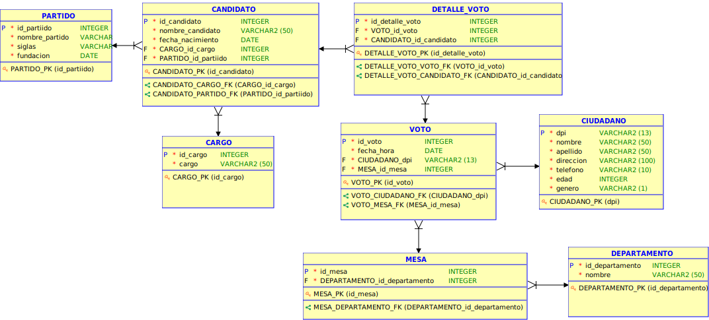

*Universidad de San Carlos de Guatemala*  
*Escuela de Ingeniería en Ciencias y Sistemas, Facultad de Ingenieria*  
*Sistemas de bases de datos 1, 2023.*  

___
## **PROYECTO 1**
___
**Angel Geovany Aragón Pérez**  
**201901055**
___
## **MANUAL TECNICO**
### **Modelo conceptual**
En el modelo conceptual, se han identificado las siguientes entidades:

1. **PARTIDO**: Esta entidad almacena información relacionada con los partidos políticos.
2. **CANDIDATO**: En esta entidad, se registra la información pertinente acerca de los candidatos políticos.
3. **CARGO**: La entidad de CARGO alberga información sobre los diferentes cargos electivos existentes.
4. **VOTO**: Aquí se recopila la información referente a los votos emitidos durante el proceso electoral.
5. **CIUDADANO**: Esta entidad se encarga de almacenar datos relacionados con los ciudadanos que participan en las elecciones.
6. **MESA**: En la entidad MESA, se guarda información relativa a las mesas de votación utilizadas en el proceso electoral.
7. **DEPARTAMENTO**: Esta entidad contiene información sobre los distintos departamentos.

Posteriormente, se establecieron relaciones entre estas entidades, aunque no se entrarán en detalles en este modelo.

### **Normalizacion de datos**
Antes de proceder con la elaboración de los modelos posteriores, se llevó a cabo un proceso de normalización de los datos. Este proceso se llevó a cabo con el propósito de eliminar cualquier duplicación de datos y, en caso necesario, dividir campos para garantizar la integridad y la coherencia de la información.

### **Modelo Logico**
En este modelo se ha establecido la organización de los datos y cómo se relacionan entre sí. A continuación, se detallan las entidades y sus atributos

**Entidades y Atributos:**
| PARTIDO     | CANDIDATO   | CARGO       | VOTO | DETALLE_VOTO | CIUDADANO  | MESA | DEPARTAMENTO |
|-------------|-------------|-------------|------|--------------|------------|------|--------------|
|id_partido|id_candidato|id_cargo|id_voto|id_detalle_voto|dpi|id_mesa|id_departamento|
|nombre_partido|nombre_candidato|cargo|fecha_hora|||nombre||nombre|
|siglas|fecha_nacimiento|||||apellido|||
|fundacion||||||direccion|||
|||||||telefono|||
|||||||edad|||
|||||||genero|||

**Relaciones entre Entidades:**
+ Se ha establecido una relación uno a muchos entre la entidad PARTIDO y la entidad CANDIDATO, ya que cada candidato debe pertenecer a un partido.
+ Se ha definido una relación uno a muchos entre la entidad CARGO y la entidad CANDIDATO, ya que cada candidato debe ocupar un cargo.
+ Para normalizar la entidad VOTO y eliminar duplicidades, se creó la entidad DETALLE_VOTO, que tiene una relación muchos a uno con la entidad VOTO.
+ Se ha establecido una relación de uno a muchos entre las entidades CIUDADANO y VOTO, ya que cada ciudadano puede emitir varios votos para diferentes cargos (presidencia, alcaldes, etc.).
+ Se ha definido una relación de uno a muchos entre las entidades DEPARTAMENTO y MESA, ya que en un departamento puede haber varias mesas de votación.
+ Se ha establecido una relación de uno a muchos entre las entidades MESA y VOTO, ya que en una mesa pueden realizarse varias votaciones.
+ Se ha definido una relación de uno a muchos entre las entidades VOTO y DETALLE_VOTO para distinguir los votos emitidos para diferentes cargos.

### **Modelo Relacional**

Para concluir, se definieron los datos de la base de datos, las llaves primarias y las llaves foráneas necesarias para llevar a cabo la implementación física de manera exitosa.

**PARTIDO** 
| Atributo   | Tipo de dato  |
|------------|---------------|
|id_partido|INTEGER|
|nombre_partido|VARCHAR(50)|
|siglas|VARCHAR(50)|
|fundacion|DATE|

| Llave Primaria|
|----------------|
|id_partido|

**CARGO** 
| Atributo   | Tipo de dato  |
|------------|---------------|
|id_cargo|INTEGER|
|cargo|VARCHAR(50)|

| Llave Primaria|
|----------------|
|id_cargo|

**CANDIDATO** 
| Atributo   | Tipo de dato  |
|------------|---------------|
|id_candidato|INTEGER|
|nombre_candidato|VARCHAR(50)|
|fecha_nacimiento|DATE|

|Llave Primaria|
|----------------|
|id_candidato|

|Llave Foraneas|Entidad|Atributo|
|--------------|-------|--------|
|FK|CARGO|id_cargo|
|FK|PARTIDO|id_partido|

**DEPARTAMENTO** 
| Atributo   | Tipo de dato  |
|------------|---------------|
|id_departamento|INTEGER|
|nombre|VARCHAR(50)|

|Llave Primaria|
|----------------|
|id_departamento|

**MESA** 
| Atributo   | Tipo de dato  |
|------------|---------------|
|id_mesa|INTEGER|

|Llave Primaria|
|----------------|
|id_departamento|

|Llave Foraneas|Entidad|Atributo|
|--------------|-------|--------|
|FK|DEPATAMENTO|id_departamento|

**CIUDADANO** 
| Atributo   | Tipo de dato  |
|------------|---------------|
|dpi|INTEGER|
|nombre|VARCHAR(50)|
|apellido|VARCHAR(50)|
|direccion|VARCHAR(100)|
|telefono|VARCHAR(10)|
|edad|INTEGER|
|genero|VARCHAR(2)|

|Llave Primaria|
|----------------|
|dpi|

**VOTO** 
| Atributo   | Tipo de dato  |
|------------|---------------|
|id_voto|INTEGER|
|fecha_hora|DATE|

|Llave Primaria|
|----------------|
|id_voto|

|Llave Foraneas|Entidad|Atributo|
|--------------|-------|--------|
|FK|MESA|id_mesa|
|FK|CIUDADANO|dpi|

**DETALLE_VOTO** 
| Atributo   | Tipo de dato  |
|------------|---------------|
|id_detalle_voto|INTEGER|

|Llave Primaria|
|----------------|
|id_detalle_voto|

|Llave Foraneas|Entidad|Atributo|
|--------------|-------|--------|
|FK|VOTO|id_voto|
|FK|CANDIDATO|id_candidato|

### **SCRIPT**
Una vez creado el modelo relacional, el siguiente paso sería generar el script SQL para crear el modelo en la base de datos deseada. Los scripts utilizados se encuentra en el repositorio en la carpeta "Scripts".

